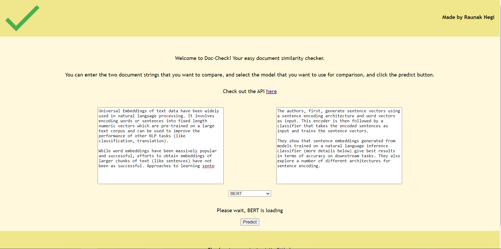
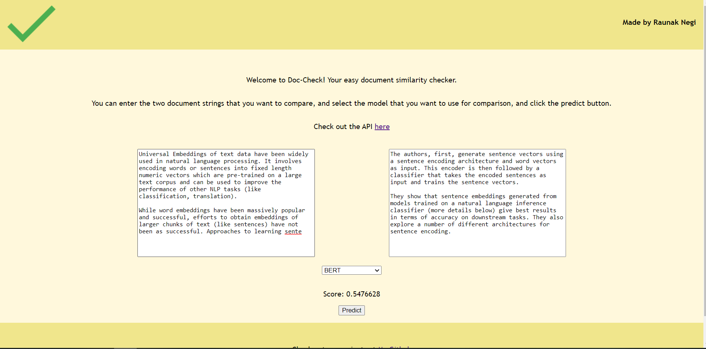
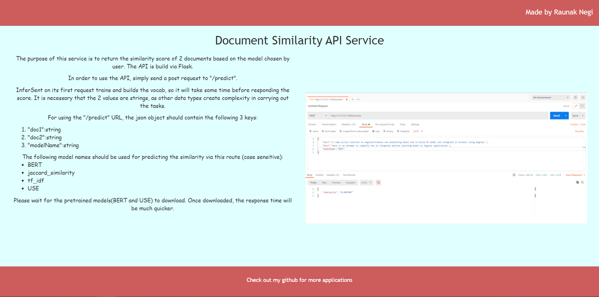

# similarity-checker
This is a simple similarity-checker application run locally on the system. It uses Angular 10 for frontend and Flask for backend.

### Functioning
1. The user enters the 2 text documents that want to be checked for a similarity score. 
2. After clicking the predict button, the strings are send to backend flask api where the strings are extracted along with the model name to be used
3. The extracted strings are used to calculate the similarity score, which is returned by the API as a json object
4. The returned JSON object is used to extract the score and display it to the user

### Examples

### Reproducing in your system

In order to reproduce this work in your system, you need to install the node modules required for angular framework. These modules can be easily installed with the <pre>package.json</pre> file in front-end directory

The Flask API requires some specific python libraries, which are listed in <pre>requirements.txt</pre>

After installing the required packages and libraries, run 2 terminals and perform the following functions
1. switch to the front-end directory, and run <pre> ng serve</pre>
2. In the second terminal, switch to the API directory and run <pre>python app.py</pre>

#### Note:
The usual local URL for Angular is localhost:4200 and for Flask is localhost:5000. Please make sure of these default URLs, as the project is build accordingly to this.
